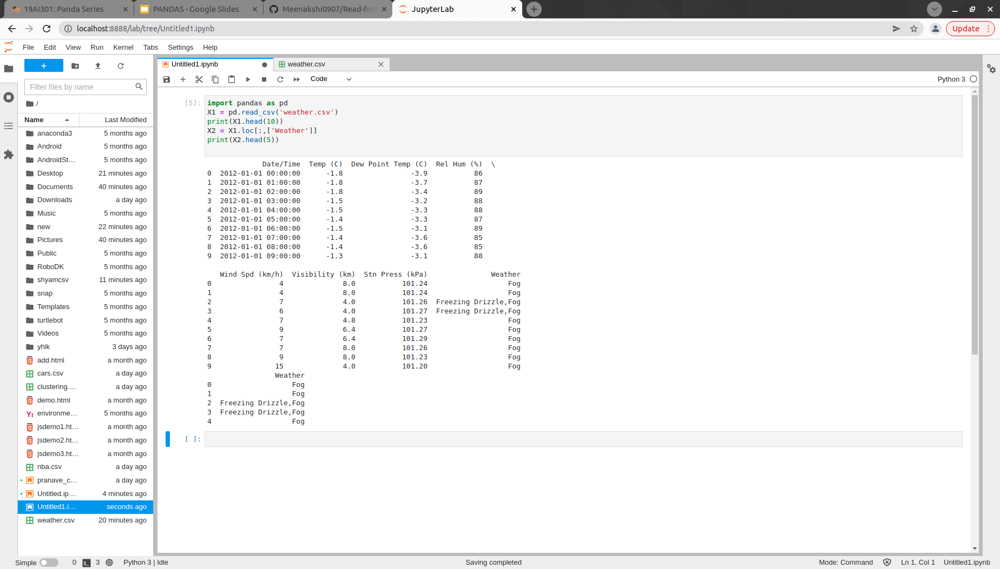

# Read-from-CSV

## AIM:
To read a CSV file.

## ALGORITHM:
### Step 1: 
Open Jupyter Lab or Visual Studio Code.
### Step 2:
Create a new file and add a CSV file in it.
### Step 3:
Write the codings.
### Step 4:
Save the codings.
### Step 5:
Screenshot the output and submit.

## PROGRAM:
~~~

# Developed by Shyam Kumar.A
# Ref No: 21001647

import pandas as pd
X1 = pd.read_csv('weather.csv')
print(X1.head(10))
X2 = X1.loc[:,['Weather']]
print(X2.head(5))

~~~

## OUTPUT:

## RESULT:
Thus,a file is read successfully.
